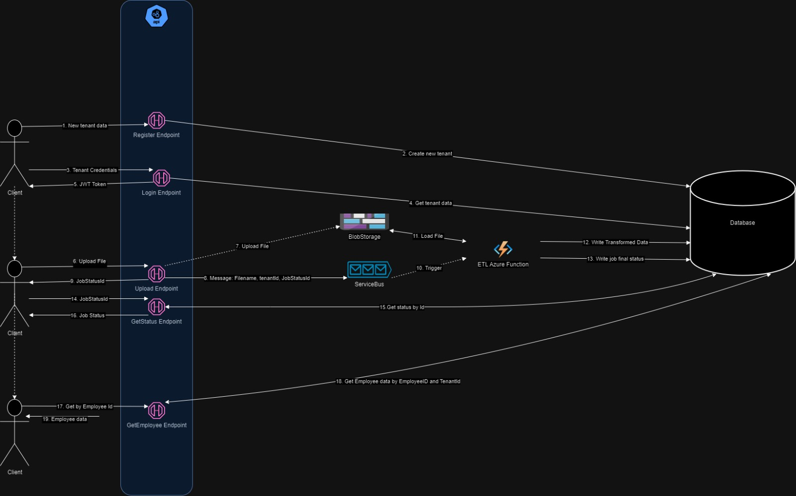

# README
**App Url**: https://hrwebapi20240206.azurewebsites.net/swagger/index.html
### How it works
#### Diagram

#### Participants
- **Client**: Represents the user interacting with the system.
- **Register Endpoint**: Registers a new tenant.
- **Login Endpoint**: Authenticates the client based on provided credentials and provides an authentication token.
- **Upload Endpoint**: Handles the process of uploading files.
- **GetStatus Endpoint**: Retrieves the status of an ETL job based on a given ID.
- **GetEmployee Endpoint**: Retrieves a user based on a given Employee ID (and tenant ID from authentication token)
- **Blob Storage**: Stores uploaded files.
- **ServiceBus**: Facilitates communication between components.
- **ETL Function**: ServiceBus triggered function that performs Extract, Transform, Load operations on data. 
- **Database**: Stores and retrieves data.

#### Sequence of Operations

1. **Client Interaction with Authentication**:
   - To register a new tenant, the client provides registration credentials.
   - The system registers the new tenant in the database.
   - For subsequent interactions, the client provides tenant credentials to the login endpoint.
   - Tenant data is retrieved from the database to validate the provided credentials.
   - Upon successful authentication, the system generates a JWT token and sends it to the client for authentication purposes.

2. **Client Interaction with Upload Endpoint**:
   - The client initiates a file upload operation.
   - The upload endpoint receives the file and stores it in Blob Storage for later processing.

3. **API Interaction with ServiceBus and ETL Function**:
   - Upon successful file upload, the API sends a message to the ServiceBus.
   - This message contains essential metadata such as the filename, tenant ID, and a newly generated JobStatusID.
   - The ServiceBus triggers the ETLFunction (Azure Function) in response to the message.

4. **ETL Function Interaction with Blob Storage and Database**:
   - The ETLFunction retrieves the uploaded file from Blob Storage.
   - Data is extracted, transformed, and loaded into the database.
   - The final status of the job, including success or failure, is recorded in the database.

5. **Client Interaction with GetStatus Endpoint**:
   - To check the status of a specific ETL job, the client provides the JobStatusID.
   - The GetStatus endpoint retrieves the corresponding job status from the database and returns it to the client.

6. **Client Interaction with GetEmployee Endpoint**:
   - The client requests employee data by providing an Employee ID.
   - The GetEmployee endpoint retrieves the relevant employee data from the database, ensuring data isolation based on the tenant ID provided during authentication.
   - The retrieved employee data is returned to the client.

### Secrets

- All the secrets are stored in an Azure Key Vault.
- The API secrets are retrived leverging the integration .Net Core IConfiguration with Azure Key Vault.
- The Azure Function secrets are retrieved from from the Azure Key Vault via References in the AppSettings (Function Configuration in Portal)

### Known Issues

- **Storing all the data in the same table/DB**: The system lacks proper tenant isolation, which may lead to data leakage or unauthorized access in multi-tenant environments.

- **Composite Primary Key Requirement**: Currently, the primary key (PK) should be composed of both EmployeeId and TenantId for proper data segmentation and security.

- **Inability to Update User Data**: Users cannot update their data in the current implementation, which may limit the system's usability and flexibility.

- **File Loading Failure with Existing EmployeeID**: Loading a file containing an already inserted EmployeeID disrupts the entire process, indicating a need for better error handling and data validation.

- **Use of Simple String Instead of GUID**: The system employs simple strings where GUIDs should have been used, which can impact data integrity and uniqueness.

### Improvements

- **Parallelization of ETL Processes**: Enhance system efficiency by implementing parallel processing for Extract, Transform, and Load operations, reducing overall processing time.

- **Integration Tests**: Implement comprehensive integration tests to ensure the robustness and reliability of the system, validating end-to-end functionality and interactions between components.

- **Additional CRUD Endpoints for Employee Management**: Extend the system's functionality by introducing additional endpoints for CRUD operations related to employee data.

- **Infrastructure as Code:** Use Bicep, Pulumi or Terraform to provide an IaC approach. Right now, everything is manually deployed in Azure.

#### Personal Note
Easy to notice, this file was enchanced with some ChatGPT help - just to make things clearer and professional. 

I absolutely loved diving into this project, brushing up on my skills, and exploring with some tools that I didn't use  or - to be more precised - configured before.